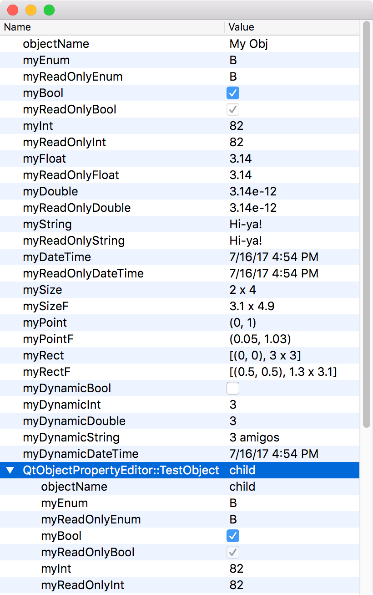

# QtPropertyEditor

UI property editors for QObject-derived classes.

* QObject editor is tree view similar to the editor in QtDesigner.
* QObjectList editor is a table view where rows are objects and columns are properties.
    * Allows dynamic object (row) insertion and deletion similar to Excel.
    * Supports object reordering by dragging rows with the mouse.
* Default delegates for editing common value types (these are in addition to the default delegates already in Qt):
    * bool: QCheckBox
    * QEnum: QComboBox
    * double: QLineEdit that can handle scientific notation
    * QSize/QSizeF: QLineEdit for text format *(w x h)*
    * QPoint/QPointF: QLineEdit for text format *(x, y)*
    * QRect/QRectF: QLineEdit for text format *[(x, y) w x h]*

**Author**: Marcel Goldschen-Ohm  
**Email**:  <marcel.goldschen@gmail.com>  
**License**: MIT  
Copyright (c) 2017 Marcel Goldschen-Ohm 

## QtPropertyTreeEditor

Property editor for a QObject is a tree view with two columns of property name/value pairs. Child objects are expandable branches with their own property name/value pairs. Maximum tree depth can be specified (i.e. depth = 0 implies no children shown).



## QtPropertyTableEditor

Editor for a list of QObjects is a table where rows are objects and columns are properties. Allows dynamic insertion/deletion of objects (rows) via a context menu obtainable by right clicking on the row headers (similar to Excel). List objects (rows) can be reordered by dragging the row header with the mouse. :warning: **All of this only makes sense if all of the objects to be exposed in the editor have the same properties (i.e. they are all the same type of object).** 


## INSTALL

Everything is in:

* `QtPropertyEditor.h`
* `QtPropertyEditor.cpp`

### Requires:

* [Qt](http://www.qt.io)

## QtPropertyTreeEditor Example

The QApplication, same as always.

```cpp
QApplication app(...);
```

An object derived from QObject whose properties will be exposed in the editor.

```cpp
TestObject object; // See test_QtPropertyEditor.h
```

Children of the object (and their children recursively) are shown as branches of the object's tree.

```cpp
TestObject *child = new TestObject("MyChild");
child->setParent(&object);
```

The model interface to our object's properties.

```cpp
QtPropertyEditor::QtPropertyTreeModel model;
model.setObject(&object);
```

**[Optional]** You can define which properties to expose in the editor (default includes all properties including dynamic properties). For example, if we only wanted to show the "objectName" and "myInt" properties:
    
```cpp
model.setProperties("objectName, myInt");
model.addProperty("myDouble");
```

**[Optional]** You can map property names to headers that will be displayed instead of the property name. Usually, this is when you want some nonstandard charachters to be displayed that are not allowed to be part of the property name. For example, if we wanted the "objectName" property to be displayed as if it was the "Name" property instead:

```cpp
model.propertyHeaders["objectName"] = "Name";
```

You can also specify property headers in the `setProperties` or `addProperty` functions by including "name: header" string pairs:

```cpp
model.setProperties("objectName: Name, myInt");
model.addProperty("myDouble: My Cool Double");
```

The tree view UI editor linked to our object's model interface. **Note: The editor owns its own tree model that it is linked to by default and which will be deleted along with the editor. However, you are free to link the editor to another model via `setModel()` if you want to.**

```cpp
QtPropertyEditor::QtPropertyTreeEditor editor;
editor.setModel(&model); // OR do NOT call this to use the default editor.treeModel model.
```

Show the editor and run the application.

```cpp
editor.show();
app.exec();
```

## QtPropertyTableEditor Example

The QApplication, same as always.

```cpp
QApplication app(...);
```

A list of objects derived from QObject whose properties will be exposed in the editor. Although it is NOT required, for this example we'll make the objects in our list children of a single parent object. :warning: **All of this only makes sense if all of the objects to be exposed in the editor have the same properties (i.e. they are all the same type of object).** 

```cpp
QObject parent;
for(int i = 0; i < 5; ++i) {
    // TestObject defined in test_QtPropertyEditor.h
    QObject *object = new TestObject("My Obj " + QString::number(i));
    object->setParent(&parent);
}
QObjectList objects = parent->children();
```

The model interface to the properties in our list of objects.

```cpp
QtPropertyEditor::QtPropertyTableModel model;
model.setObjects(objects);
```

**[Optional]** For dynamic object insertion in the list, you need to supply an object creator function of type `QtPropertyTableModel::ObjectCreatorFunction` which is a typedef for `std::function<QObject*()>`. **If you want the newly created objects to be children of a particular parent object, you need to wrap this into the creator function. For example, as shown below.**
    
```cpp
// The creator function.
QObject* createNewTestObject(QObject *parent)
{
    // TestObject defined in test_QtPropertyEditor.h
    return new TestObject("New Test Object", parent);
}
```
    
```cpp
// This will make sure all newly inserted objects
// in the model are children of parent.
std::function<QObject*()> func = 
    std::bind(createNewTestObject, &parent);
model.setObjectCreator(func);
```

**[Optional]** Exposed properties and their column headers can be specified exactly the same as shown in the example above for QtPropertyTreeEditor.

**[Optional]** Default is a flat editor for each object's properties excluding properties of child objects. However, specific child object properties can be made available in the table view by adding *"path.to.child.property"* to the specified list of property names to be displayed. In this case, *path*, *to* and *child* are the object names of a child object tree, and *property* is a property name for *child*. Note that for this to make sense all objects in the list should have a valid *"path.to.child.property"*. For example, to expose the "myInt" property of the child object named "child":
    
```cpp
model.addProperty("child.myInt");
```

The table view UI editor linked to the model interface for our list of objects. **Note: The editor owns its own table model that it is linked to by default and which will be deleted along with the editor. However, you are free to link the editor to another model via `setModel()` if you want to.**

```cpp
QtPropertyEditor::QtPropertyTableEditor editor;
editor.setModel(&model); // OR do NOT call this to use the default editor.tableModel model.
```

Show the editor and run the application.

```cpp
editor.show();
app.exec();
```
