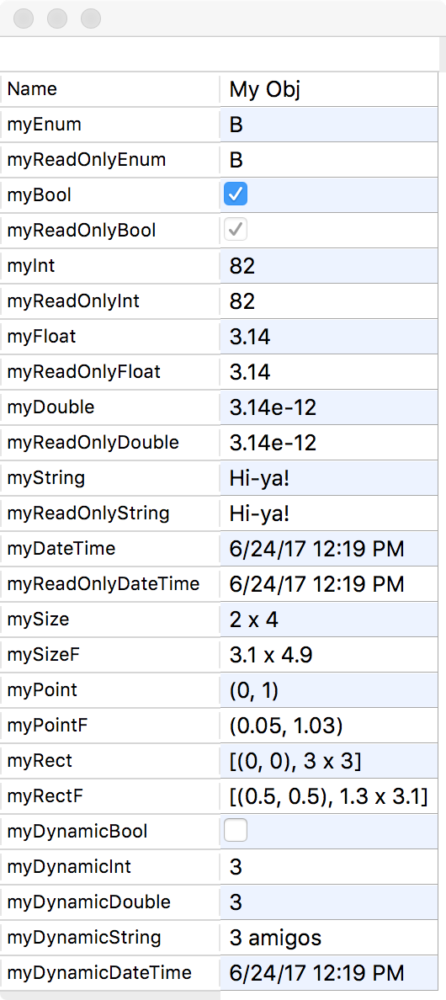
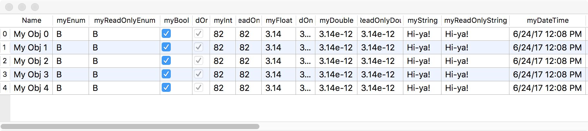

# QtObjectPropertyEditor

UI property editors for a QObject or a QObjectList.

* Editor for a single QObject is a column list of properties.
    * 
* Editor for a list of QObjects is a table where rows are objects and columns are properties.
    * 
    * Rows (objects) can be rearranged by dragging the row header with the mouse.
    * Allows dynamic insertion/deletion of objects (rows) via a context menu obtainable by right clicking on the row headers (similar to Excel).
* Default delegates for editing common value types (these are in addition to the default delegates already in Qt):
    * bool: QCheckBox
    * QEnum: QComboBox
    * double: QLineEdit that can handle scientific notation
    * QSize/QSizeF: QLineEdit for text format *(w x h)*
    * QPoint/QPointF: QLineEdit for text format *(x, y)*
    * QRect/QRectF: QLineEdit for text format *[(x, y) w x h]*
* Default is a flat editor for an object's properties excluding properties of child objects.
    * Specific child object properties can be made available in the editor via a *"path.to.child.property"* string. In this case, *path*, *to* and *child* are the object names of the child object tree, and *property* is a property name for *child*.

**Author**: Marcel Goldschen-Ohm  
**Email**:  <marcel.goldschen@gmail.com>  
**License**: MIT  
Copyright (c) 2017 Marcel Goldschen-Ohm 

## INSTALL

Everything is in:

* `QtObjectPropertyEditor.h`
* `QtObjectPropertyEditor.cpp`

### Requires:

* [Qt](http://www.qt.io)

## Edit properties of a single QObject.

See `testQtObjectPropertyEditor.cpp`.

## Edit properties for each object in a QObjectList.

See `testQtObjectListPropertyEditor.cpp`.
